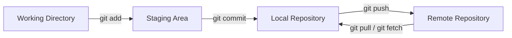

# 📘 Git Commands Cheat Sheet

This document provides a quick reference for essential Git commands, their usage, and explanations. Perfect for beginners and intermediate developers working with Git and GitHub.

---

## 🔹 Initialization

### 1. `git init`

**Usage:**

```bash
git init [repository-name]
```

Creates a new Git repository in the chosen project directory by generating a hidden `.git` folder that monitors and records changes.

---

## 🔹 Staging and Committing

### 2. `git add`

**Usage:**

```bash
git add [file-name]  
git add .  
git add *  
git add -A  
```

Stages files (specific or all) to prepare them for the next commit.

### 3. `git commit`

**Usage:**

```bash
git commit -m "commit message"
```

Records staged changes and creates a snapshot with a descriptive message.

### 4. `git status`

**Usage:**

```bash
git status
```

Displays the state of the working directory and staging area (staged, unstaged, or untracked files).

---

## 🔹 Remote Repository Management

### 5. `git remote`

**Usage:**

```bash
git remote add origin [URL]
```

Links the local repository to a remote (GitHub, GitLab, Bitbucket, etc.).

### 6. `git push`

**Usage:**

```bash
git push origin [branch-name]
```

Uploads commits from the local branch to the remote repository.

### 7. `git clone`

**Usage:**

```bash
git clone [URL]
```

Downloads a repository from a remote source to your local machine.

To create a new directory and clone:

```bash
mkdir [directory-name]  
cd [directory-name]  
git clone [URL]
```

---

## 🔹 Branching and Navigation

### 8. `git branch`

**Usage:**

```bash
git branch [branch-name]     # Create branch  
git branch -D [branch-name]  # Delete branch
```

Manages independent development workflows.

### 9. `git checkout`

**Usage:**

```bash
git checkout [branch-name]     # Switch to branch  
git checkout -b [branch-name]  # Create and switch
```

Moves between branches.

### 10. `git log`

**Usage:**

```bash
git log  
git log --graph  
git log --graph --pretty=oneline
```

Shows commit history in different formats.

---

## 🔹 Stashing and Reverting

### 11. `git stash`

**Usage:**

```bash
git stash  
git stash -u  
git stash pop
```

Temporarily saves changes without committing (useful when switching branches).

### 12. `git revert`

**Usage:**

```bash
git revert [commit-id]
```

Creates a new commit that undoes changes from a previous commit, while preserving history.

---

## 🔹 Comparing, Merging, and Rebasing

### 13. `git diff`

**Usage:**

```bash
git diff [commit1] [commit2]
```

Shows differences between commits, files, or branches.

### 14. `git merge`

**Usage:**

```bash
git merge [branch-name]
```

Merges changes from one branch into another.

### 15. `git rebase`

**Usage:**

```bash
git rebase [base]
```

Reapplies commits onto another base commit for a cleaner history.

---

## 🔹 Fetching and Resetting

### 16. `git fetch`

**Usage:**

```bash
git fetch
```

Retrieves updates from a remote repository without merging.

### 17. `git reset`

**Usage:**

```bash
git reset --hard [commit-id]
```

Resets the repo to a previous commit, discarding later changes. ⚠️ **Destructive operation.**

### 18. `git pull`

**Usage:**

```bash
git pull origin [branch-name]
```

Fetches and merges updates from the remote repo into the current branch.

---

## 🔹 Git Workflow Diagram



---

## ✅ Conclusion

This cheat sheet covers the **most frequently used Git commands** for version control, collaboration, and workflow management. Use it as a handy reference while working with Git projects.

---