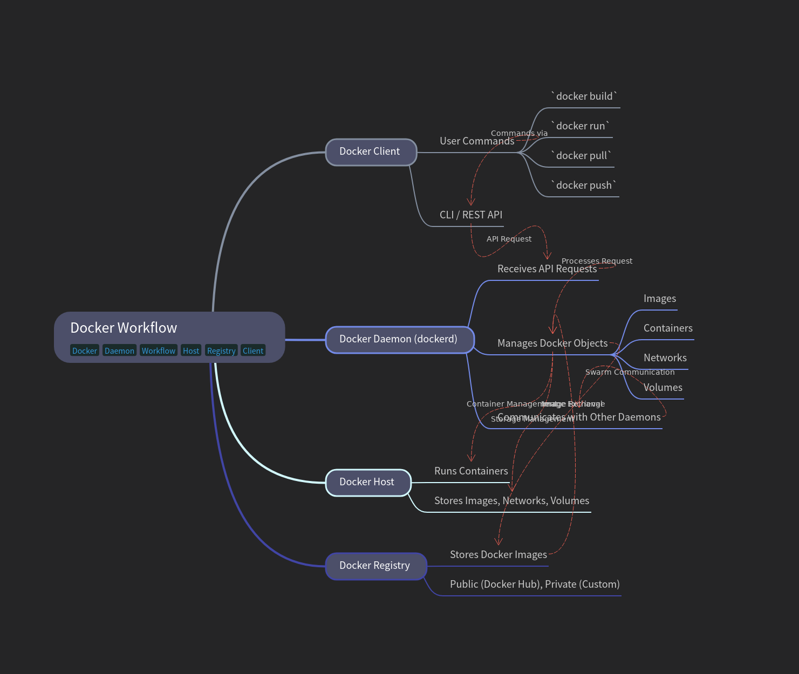
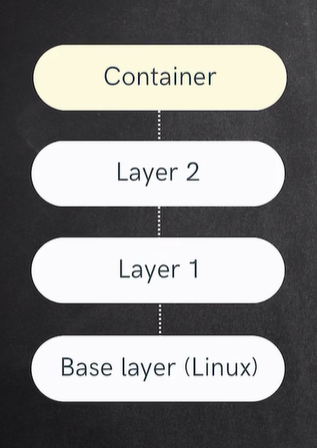

# 🐳 Docker Guide

## 📌 What is Docker?

Docker is an **open-source platform** that allows you to **develop, ship, and run applications** inside lightweight, portable containers.

* A **container** is like a lightweight virtual machine that includes everything your application needs (code, runtime, libraries, dependencies).
* Docker makes sure your app runs the same everywhere — on your laptop, on a server, or in the cloud.

### 🔹 Benefits of Docker:

* 🚀 **Portability** – Run apps anywhere (local, cloud, server).
* ⚡ **Lightweight** – Containers share the host OS kernel, making them faster than VMs.
* 🛠 **Consistency** – Works the same in dev, test, and production.
* 🔄 **Scalability** – Easy to scale using orchestration tools like Docker Compose or Kubernetes.


<p align="center">
  
</p>
---

## 🔹 Basic Docker Commands

```bash
# Check Docker version
docker --version

# List running containers
docker ps

# List all containers (running + stopped)
docker ps -a

# List all images
docker images

# Stop a container
docker stop <container_id>

# Remove a container
docker rm <container_id>

# Remove an image
docker rmi <image_id>
```

---

## 🔹 Working with Images

```bash
# Build image from Dockerfile
docker build -t <image_name>:<tag> .

# Pull an image from Docker Hub
docker pull <image_name>:<tag>

# Push an image to Docker Hub
docker push <username>/<image_name>:<tag>
```

---

## 🔹 Running Containers

```bash
# Run a container (detached mode)(We can name our container)
docker run -d --name <container_name> <image_name>:<tag>

# Run a container with port mapping
docker run -d -p 8080:80 --name <container_name> <image_name>:<tag>

# Run a container with mounted volume
docker run -d -v $(pwd):/app --name <container_name> <image_name>:<tag>

# Run a container interactively
docker run -it <image_name>:<tag> /bin/bash
```

---

## 🔹 Docker Compose

```bash
# Start services
docker-compose up -d

# Stop services
docker-compose down

# Rebuild and start services
docker-compose up --build -d
```

---

## 🔹 Logs & Exec (Troubleshoot Commands)

```bash
# View container logs
docker logs <container_name>

# View logs in real-time
docker logs -f <container_name>

# Execute a command inside container
docker exec -it <container_name> /bin/bash
```

> NOTE: Images can only be deleted only when no containers are using them.

---

# 🐳 How to Write a Dockerfile

A **Dockerfile** is just a text file (named `Dockerfile` with no extension) that contains a set of instructions to build a Docker image.

---

## 📌 General Steps in a Dockerfile

1. **Choose a Base Image**
   Start with an existing image (like Node.js, Python, Ubuntu, Nginx).

   ```dockerfile
   FROM node:18
   ```

2. **Set a Working Directory**
   Define where inside the container your app will live.

   ```dockerfile
   WORKDIR /app
   ```

3. **Copy Dependencies First**
   Copy files like `package.json` or `requirements.txt` so Docker can cache dependencies.

   ```dockerfile
   COPY package*.json ./
   ```

4. **Install Dependencies**
   Run commands inside the container.

   ```dockerfile
   RUN npm install
   ```

5. **Copy the Rest of the Code**
   Bring your application files into the image.

   ```dockerfile
   COPY . .
   ```

6. **Expose a Port**
   Tell Docker which port your app listens on (optional).

   ```dockerfile
   EXPOSE 3000
   ```

7. **Define Start Command**
   Define how the container should start.

   ```dockerfile
   CMD ["npm", "start"]
   ```

---

## 🔹 Example 1: **Node.js App**

```dockerfile
# Step 1: Use official Node.js image
FROM node:18

# Step 2: Set working directory
WORKDIR /app

# Step 3: Copy dependency files
COPY package*.json ./

# Step 4: Install dependencies
RUN npm install

# Step 5: Copy application code
COPY . .

# Step 6: Expose port
EXPOSE 3000

# Step 7: Start app
CMD ["npm", "start"]
```

---

## 🔹 Example 2: **Python Flask App**

```dockerfile
FROM python:3.10
WORKDIR /app
COPY requirements.txt .
RUN pip install --no-cache-dir -r requirements.txt
COPY . .
EXPOSE 5000
CMD ["python", "app.py"]
```

---

## 🔹 Example 3: **Static Website with Nginx**

```dockerfile
FROM nginx:alpine
COPY . /usr/share/nginx/html
EXPOSE 80
```

---

## 🚀 Build & Run

After creating your `Dockerfile` in the project root:

```bash
# Build image
docker build -t my-app .

# Run container
docker run -d -p 3000:3000 my-app
```
---

# 🐳 Docker Image vs Docker Container

### 🔹 **Docker Image**

* A **blueprint** or **template** used to create containers.
* It contains the application code, dependencies, libraries, environment settings, and everything required to run the app.
* **Read-only** (cannot be changed once built).
* Think of it like a **class in OOP** or an **ISO file**.

👉 Example:

```bash
docker build -t my-app .
docker pull nginx:latest
```

Here `my-app` and `nginx:latest` are **images**.

---

### 🔹 **Docker Container**

* A **running instance** of a Docker image.
* Containers are **live, executable environments** that can be started, stopped, moved, and deleted.
* Containers are **writable** (you can add/modify files inside them).
* Think of it like an **object in OOP** or a **running VM from an ISO file**.

👉 Example:

```bash
docker run -d -p 8080:80 nginx:latest
```

This starts a **container** from the `nginx` image.

---

<p align="center">
  
</p>

# 📌 Key Differences

| Feature        | Docker Image 🖼️     | Docker Container 📦                                 |
| -------------- | -------------------- | --------------------------------------------------- |
| **Definition** | Blueprint / template | Running instance of an image                        |
| **State**      | Static (read-only)   | Dynamic (live, running)                             |
| **Mutability** | Cannot change        | Can change while running                            |
| **Lifecycle**  | Exists as a file     | Created from image, runs, stops, and can be removed |
| **Analogy**    | Class / ISO file     | Object / Running OS                                 |

---

✅ In short:

* **Image = Recipe** 🍲
* **Container = Cooked Dish** 🍛

---

# 🌐 Docker Network

Docker provides its own **networking model** so that containers can communicate with each other, with the host machine, and with the outside world.

---

## 🔹 Default Docker Networks

When you install Docker, three networks are created automatically:

1. **bridge** (default)

   * Containers on the same bridge network can talk to each other using container names.
   * If you don’t specify a network, Docker uses `bridge`.
   * Example:

     ```bash
     docker run -d --name app1 --network bridge nginx
     docker run -d --name app2 --network bridge nginx
     ```

2. **host**

   * Shares the host machine’s network.
   * No network isolation (container uses host’s IP).
   * Example:

     ```bash
     docker run -d --network host nginx
     ```

3. **none**

   * Completely isolated network (no internet access, no communication).
   * Example:

     ```bash
     docker run -d --network none nginx
     ```

---

## 🔹 User-Defined Networks

You can create your own custom networks for better control.
These are usually **bridge networks**.

```bash
#For Linux/macOS
# Create a new network
docker network create my-network

# Run containers on this network
docker run -d \
--name app1 \
--network my-network nginx


docker run -d \
--name app2 \
--network my-network nginx

# Now app1 and app2 can communicate using their names
```


```powershell
#For Windows
# Create a new network
docker network create my-network

# Run containers on this network
docker run -d `
--name app1 `
--network my-network `
nginx

docker run -d `
--name app2 `
--network my-network `
nginx
```

# Now app1 and app2 can communicate using their names
---

## 🔹 Common Network Commands

```bash
# List all networks
docker network ls

# Inspect a network (view details like connected containers)
docker network inspect my-network

# Connect a container to a network
docker network connect my-network app1

# Disconnect a container from a network
docker network disconnect my-network app1

# Remove a network
docker network rm my-network
```

---

## 📌 Example: Connecting App + Database

```bash
# Create a custom network
docker network create backend

# Run MySQL on this network
docker run -d --name my-db --network backend -e MYSQL_ROOT_PASSWORD=root mysql:8

# Run Node.js app on same network
docker run -d --name my-app --network backend my-node-app
```

👉 Now `my-app` can connect to `my-db` using hostname `my-db` instead of IP address.

---

✅ In summary:

* **bridge** = default network, containers can talk to each other.
* **host** = no isolation, uses host machine’s network.
* **none** = fully isolated.
* **custom network** = best for multi-container apps.

---

## **Steps to Push Docker Image to Docker Hub**

1. **Login to Docker Hub**

   ```bash
   docker login
   ```

   → Username & password enter karo. (Agar aapke paas Docker Hub account nahi hai to [hub.docker.com](https://hub.docker.com/) pe bana lo).

---

2. **Build Docker Image**
   Apna Dockerfile jahan hai us directory me command run karo:

   ```bash
   docker build -t username/repository_name:tag .
   ```

   Example:

   ```bash
   docker build -t priyanshuksharma/myapp:1.0 .
   ```

---

3. **Check Local Images**

   ```bash
   docker images
   ```

   Ye confirm karega ki image ban gayi hai aur sahi tag laga hua hai.

---

4. **Push Image to Docker Hub**

   ```bash
   docker push username/repository_name:tag
   ```

   Example:

   ```bash
   docker push priyanshuksharma/myapp:1.0
   ```

---

5. **Verify on Docker Hub**
   Apne account me login karke repository check karo. Wahan image upload ho chuki hogi.

---

⚡ **Quick Notes**:

* Agar tag mention nahi karte ho to default `latest` hota hai.
* Private repo me push karne ke liye Docker Hub pe repo ko private banana hoga.
* Similarly, aap **private registry** ya **AWS ECR, GCP Artifact Registry, Azure ACR** me bhi push kar sakte ho, bas login aur repo URL alag hoga.

---


